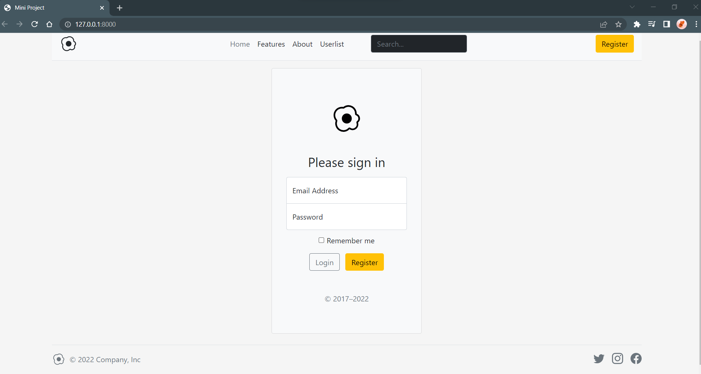

# Miniproject

A mini project that I did while undergoing the SHRDC short programme. I develop web application for online registration system using Microsoft Visual Studio Code.

- For the back-end development – using Laravel 8.0 (PHP), Apache Web Server & MySQL database
- For the front-end development – using JavaScript, Bootstrap (HTML & CSS user Interface template)

### Web Application Development Interface

